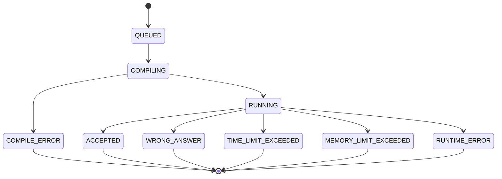

# Code executor

Microservice that:
1. Consumes submission events from Kafka (`submissions` by default).
2. Loads test cases from PostgreSQL by `problem_id`.
3. Process submission via state machine
4. Publishes processing statuses to Kafka (`submission_changed` by default)

## Judge engine
Service uses [docker-java](https://github.com/docker-java/docker-java) for compiling and executing code in secured environments

## State Machine


## Event contract

### Incoming (`submissions`)
```json
{
  "submissionId": "uuid",
  "problemId": 1,
  "userId": "uuid",
  "language": "java|cpp|python",
  "code": "...",
  "timeLimitMs": 10000,
  "memoryLimitMb": 5
}
```

### Outgoing (`submission_changed`)
`RUNNING`, then final one of `ACCEPTED`, `WRONG_ANSWER`, `RUNTIME_ERROR`, `TIME_LIMIT_EXCEEDED`, `SYSTEM_ERROR`.

