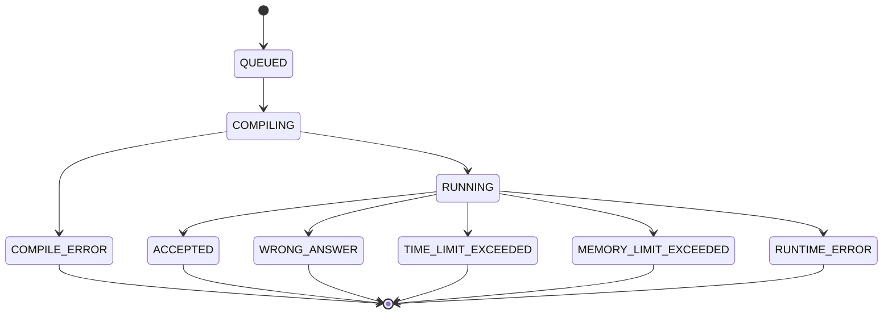

# Code executor

Microservice that:
1. Consumes submission events from Kafka (`submissionRepository` by default).
2. Loads test cases from PostgreSQL by `problem_id`.
3. Process submission via state machine
4. Publishes updated submission statuses to Kafka (`submission_statuses` by default)

## Judge engine
Service uses [docker-java](https://github.com/docker-java/docker-java) for compiling and executing code in secured environments

## Capacity and sandbox settings

Each executor processes one submission at a time by default. Kafka remains the waiting
queue, so the executor does not keep an in-memory submission queue. Listener concurrency
can be changed with:

- `CODELOOM_EXECUTOR_MAX_CONCURRENT_SUBMISSIONS=1`
- `CODELOOM_EXECUTOR_STDOUT_LIMIT_BYTES=65536`
- `CODELOOM_EXECUTOR_STDERR_LIMIT_BYTES=65536`
- `CODELOOM_EXECUTOR_TMPFS_LIMIT_BYTES=67108864`
- `CODELOOM_EXECUTOR_MAX_OPEN_FILES=1024`
- `CODELOOM_EXECUTOR_MAX_FILE_SIZE_BYTES=67108864`

Increasing listener concurrency requires the `submissions` Kafka topic to have at least
the same number of partitions. Otherwise, excess consumer threads remain idle.

The stdout and stderr limits are independent. Exceeding either stops the judge
container; compilation reports `COMPILE_ERROR` and execution reports `RUNTIME_ERROR`.

### Docker container limits

| Container | CPU limit | PID limit | Memory limit |
| --- | ---: | ---: | ---: |
| Compilation | 2 CPUs | 128 | 256 MiB |
| Test execution | 1 CPU | 64 | Submission limit, or 256 MiB when omitted |
| Volume helper | 0.5 CPU | 32 | 64 MiB |

Memory and memory-plus-swap are set to the same value, preventing containers from
growing beyond their memory allowance through swap. All containers also use a 16 MiB
shared-memory limit.

| Shared isolation control | Value | Purpose |
| --- | --- | --- |
| Network | `none` | Prevents access to external and infrastructure services. |
| Privileges and capabilities | Unprivileged; all Linux capabilities dropped | Reduces access to host and kernel operations. |
| Root filesystem | Read-only | Prevents modification of the image filesystem. |
| Security option | `no-new-privileges` | Prevents processes from gaining privileges through execution. |
| Temporary filesystem | `/tmp`, `rw,noexec,nosuid`, 64 MiB | Allows bounded temporary files without executable or setuid content. |
| Open files | 1024 | Limits file-descriptor exhaustion. |
| File size | 64 MiB | Prevents unbounded file creation. |
| Core dumps | Disabled | Prevents large dumps and unintended data exposure. |
| Init process | Enabled | Reaps child processes inside the container. |

The tmpfs, open-file, and file-size values can be changed with
`CODELOOM_EXECUTOR_TMPFS_LIMIT_BYTES`, `CODELOOM_EXECUTOR_MAX_OPEN_FILES`, and
`CODELOOM_EXECUTOR_MAX_FILE_SIZE_BYTES`. CPU, PID, helper-memory, default-memory, and
shared-memory limits are fixed in `DockerConstraints`. Submission memory applies only
to test execution; compilation always uses the fixed 256 MiB default.

## State Machine

```mermaid
stateDiagram-v2
    [*] --> QUEUED
    
    QUEUED --> COMPILING
    COMPILING --> COMPILE_ERROR
    COMPILING --> RUNNING
    RUNNING --> ACCEPTED
    RUNNING --> WRONG_ANSWER
    RUNNING --> TIME_LIMIT_EXCEEDED
    RUNNING --> MEMORY_LIMIT_EXCEEDED
    RUNNING --> RUNTIME_ERROR
    
    COMPILE_ERROR --> [*]
    ACCEPTED --> [*]
    WRONG_ANSWER --> [*]
    TIME_LIMIT_EXCEEDED --> [*]
    MEMORY_LIMIT_EXCEEDED --> [*]
    RUNTIME_ERROR --> [*]
```

## Event contract

### Incoming (`submissionRepository`)
```json
{
  "submissionId": "uuid",
  "problemId": 1,
  "userId": "uuid",
  "language": "java|cpp|python",
  "code": "...",
  "timeLimitMs": 10000,
  "memoryLimitMb": 5
}
```

### Outgoing (`submission_statuses`)
```json
{
  "submissionId": "uuid",
  "problem_id": 1,
  "userId": "uuid",
  "new_status": "<submission_status>",
  "payload": {}
}
```

